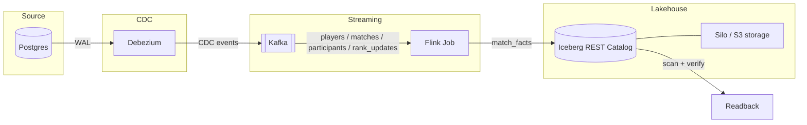

## Marvel Rivals Ranked Games Simulator

A Kafka → Debezium → Flink → Iceberg CDC pipeline demo. Simulates ranked Marvel Rivals matches, streams the writes out of Postgres via CDC, joins them in-flight with Flink, and lands enriched match facts in Iceberg. 

## Architecture


## Stack

| Component | Role |
|---|---|
| Postgres | System of record — players, matches, participants, rank updates |
| Debezium | CDC connector, publishes row-level changes to Kafka |
| Kafka | Event backbone for CDC topics |
| Flink | Stateful stream processing — joins CDC streams into enriched match facts |
| Iceberg (REST catalog) | Table format for streaming writes |
| Silo (S3) | Object storage backing the Iceberg warehouse |

## Quickstart

```bash
docker compose up --build
```

This brings up Postgres, Kafka, Debezium, Flink, the Iceberg REST catalog, and Silo (S3), then:

1. **Seed** inserts 48 players into Postgres
2. **matches** simulates ranked games (12 players each) into Postgres — events, participants, rank updates
3. **Debezium** CDC publishes those writes to Kafka
4. **Flink** joins the streams into match facts (player + match + rank as-of match start)
5. Facts append to the Iceberg table `demo.match_facts` (Parquet on Silo)
6. **readback** scans that table over REST + S3 and checks row count and rank-as-of

To check results, wait until `matches` has exited, then:

```bash
docker compose logs readback
```

## Local UIs and endpoints

`localhost` ports are published from Compose services. The browser hits the host; the process runs inside that container. Other containers on the Compose network use the service name (`grafana`, `prometheus`, `jobmanager`, …), not `localhost`.

| Open | Compose service | Inside the container |
|---|---|---|
| [http://localhost:3000](http://localhost:3000) | `grafana` | Grafana. Anonymous Pipeline health dashboard. |
| [http://localhost:9090](http://localhost:9090) | `prometheus` | Prometheus. Metric queries and targets. |
| [http://localhost:8081](http://localhost:8081) | `jobmanager` | Flink Web UI. Job, checkpoints, backpressure. |
| [http://localhost:9001](http://localhost:9001) | `silo` | Silo/MinIO console (`admin` / `password`). Object browser for the warehouse bucket. |
| [http://localhost:9000](http://localhost:9000) | `silo` | S3 API (not a UI). Iceberg Parquet lives here. |
| [http://localhost:8083](http://localhost:8083) | `connect` | Kafka Connect REST (not a UI). Debezium connector status. |
| [http://localhost:8181](http://localhost:8181) | `iceberg-rest` | Iceberg REST catalog (not a UI). Table metadata. |

No browser UI: Kafka (`broker`, host `localhost:9092`) and Postgres (`db`, host port from `POSTGRES_PORT` in `.env`). Use `kcat` / `psql` as below.

## Verifying the pipeline

**Confirm the CDC connector is running:**

```bash
curl -s http://localhost:8083/connectors/postgres-cdc/status | jq .
```

**List CDC topics:**

```bash
docker compose exec broker /opt/kafka/bin/kafka-topics.sh --bootstrap-server localhost:9092 --list
```

**Watch a topic:**

```bash
docker compose exec broker /opt/kafka/bin/kafka-console-consumer.sh \
  --bootstrap-server localhost:9092 \
  --topic dbserver1.public.players \
  --from-beginning
```

**Connect to Postgres:**

```bash
set -a && source .env && set +a
docker compose exec db psql -U "$POSTGRES_USER" -d "$POSTGRES_DB"
```

**Issue a manual change (to watch CDC propagate end-to-end):**

```bash
set -a && source .env && set +a
docker compose exec db psql -U "$POSTGRES_USER" -d "$POSTGRES_DB" -c \
  "INSERT INTO players (account_name, email) VALUES ('cdc-test', 'cdc-test@example.com');"
```

## Manual Kafka inspection (kcat)

Leave a consumer running in one terminal:

```bash
kcat -C -b localhost:9092 -t dbserver1.public.match_events -f '%s\n'
```

In a separate terminal, generate traffic:

```bash
./scripts/run_matches.sh --count 10
```

View broker metadata:

```bash
kcat -L -b localhost:9092
```