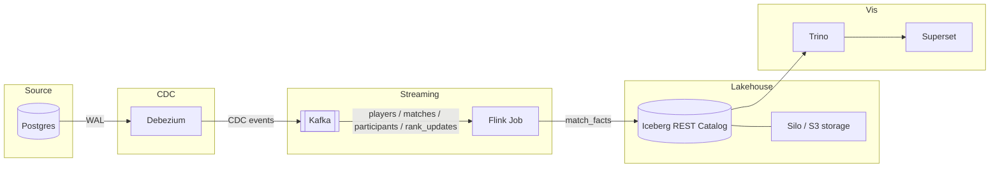

# Stream Join Lab

A Kafka, Flink, Iceberg CDC pipeline. Simulates ranked Marvel Rivals matches, streams the writes out of Postgres via CDC, joins them in-flight with Flink, and lands enriched match facts in Iceberg.

## Why

I like video games and am curious how one would model the data flow of ranked video game results. Ranked matches are a good join problem: 12 players, a match record, and a rank that must be the rank at the start of the match, not at the finish. 

- **Postgres**, **Debezium**, **Kafka**: writes go to Postgres; Debezium publishes them to Kafka; those topics are what Flink joins.
- **Flink**: I built this to show a stream join: CDC from four OLTP tables, joined in-flight, landed as match_facts with player rank as-of match start.
- **Iceberg + Silo**: Iceberg so Flink appends `match_facts` as a table, not loose Parquet. Silo is the S3 the files live on.
- **Trino + Superset**, **Grafana**: Trino is the query engine sitting on top of Iceberg, with superset as the data visability tool. Grafana for pipeline health visability and alerting, small alert playbook included.


## What it does

OLTP stays normalized (`players`, `match_events`, `match_participants`, `ranks`). `match_facts` is the analytical grain. Batch SQL can do this; this lab is the streaming version. Flink buffers 3s and emits only when a match has 12 participants.




| Component              | Role                                                                    |
| ---------------------- | ----------------------------------------------------------------------- |
| Postgres               | System of record: players, matches, participants, rank updates          |
| Debezium               | CDC connector, publishes row-level changes to Kafka                     |
| Kafka                  | Event backbone for CDC topics                                           |
| Flink                  | Stateful stream processing: joins CDC streams into enriched match facts |
| Iceberg (REST catalog) | Table format for streaming writes                                       |
| Silo (S3)              | Object storage backing the Iceberg warehouse                            |
| Trino                  | SQL engine over Iceberg                                                 |
| Superset               | Match facts vis: dashboards and SQL Lab                                 |


What `./up` starts:

1. **Seed** inserts 48 players into Postgres
2. **matches** simulates ranked games (12 players each) into Postgres: events, participants, rank updates
3. **Debezium** CDC publishes those writes to Kafka
4. **Flink** joins the streams into match facts (player + match + rank as-of match start)
5. Facts append to the Iceberg table `demo.match_facts` (Parquet on Silo)
6. **Superset** queries that table through Trino


## How to use


### Run

MacOS, Linux, or Windows. A 16GB laptop is the intended box; set the Docker memory slider to at least 8 GiB. `./up` fails below 6 GiB. Needs Docker Desktop (or Engine + Compose v2).

**Every** `./up` **is a Clean start:** it destroys Lab volumes, then builds and starts. First run is about 20 minutes (image pulls + Maven). Later runs are faster but still wipe data and replay matches. Use the URLs it prints. Ports remap if 8088/3000/8081 are taken.

Unzip or clone, `cd` into this folder, then:

**macOS / Linux / WSL**

```bash
./up
```

**Windows**

```bat
.\up.cmd
```

`./up` waits until `match_facts` has at least one row (Ready), then opens [Match facts](http://127.0.0.1:8088/superset/dashboard/match-facts/) and [Grafana Pipeline health](http://127.0.0.1:3000/d/pipeline-health). Charts keep filling (default 400 matches, about 4800 facts). Stop with `./down` (or `.\down.cmd`).

### Query match facts

SQL Lab is on the Superset URL `./up` printed (`/sqllab`). Database: **Iceberg** (read-only). Catalog `iceberg`, schema `demo`.

```sql
SELECT COUNT(*) AS facts
FROM iceberg.demo.match_facts;
```

```sql
SELECT
  hero_played,
  ROUND(100e0 * AVG(IF(result = 'win', 1e0, 0e0)), 1) AS win_rate,
  ROUND(AVG(CAST(kills AS DOUBLE)), 2) AS avg_kills,
  ROUND(AVG(CAST(deaths AS DOUBLE)), 2) AS avg_deaths
FROM iceberg.demo.match_facts
GROUP BY 1
ORDER BY win_rate DESC;
```

```sql
SELECT
  player_id,
  started_at,
  result,
  rank_tier_at_match_start,
  rank_division_at_match_start,
  rank_points_at_match_start
FROM iceberg.demo.match_facts
ORDER BY player_id, started_at
LIMIT 20;
```


### Pipeline metrics

Grafana is the URL `./up` printed (`/d/pipeline-health`). Same instance has **Flink** and **Kafka** dashboards. Flink UI URL is printed, not opened. See [Pipeline alerting](docs/alerting.md) for page versus ticket rules.

### Inspect

Use the printed URLs. Extra traffic: `docker compose --env-file .lab.env run --rm matches`. Kafka, Connect, Trino, and Prometheus are not published on the host.

**CDC connector**

```bash
docker compose --env-file .lab.env exec connect \
  curl -s http://localhost:8083/connectors/postgres-cdc/status
```

**List CDC topics**

```bash
docker compose --env-file .lab.env exec broker \
  /opt/kafka/bin/kafka-topics.sh --bootstrap-server localhost:9092 --list
```

**Watch a topic**

```bash
docker compose --env-file .lab.env exec broker \
  /opt/kafka/bin/kafka-console-consumer.sh \
  --bootstrap-server localhost:9092 \
  --topic dbserver1.public.players \
  --from-beginning
```

**Postgres**

```bash
docker compose --env-file .lab.env exec db psql -U demo -d stream_join_lab
```

**Manual change (watch CDC propagate)**

```bash
docker compose --env-file .lab.env exec db psql -U demo -d stream_join_lab -c \
  "INSERT INTO players (account_name, email) VALUES ('cdc-test', 'cdc-test@example.com');"
```

