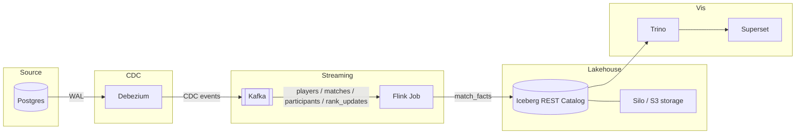

## Marvel Rivals Ranked Games Simulator

A Kafka → Debezium → Flink → Iceberg CDC pipeline demo. Simulates ranked Marvel Rivals matches, streams the writes out of Postgres via CDC, joins them in-flight with Flink, and lands enriched match facts in Iceberg.

## Architecture



## Stack

| Component | Role |
|---|---|
| Postgres | System of record — players, matches, participants, rank updates |
| Debezium | CDC connector, publishes row-level changes to Kafka |
| Kafka | Event backbone for CDC topics |
| Flink | Stateful stream processing — joins CDC streams into enriched match facts |
| Iceberg (REST catalog) | Table format for streaming writes |
| Silo (S3) | Object storage backing the Iceberg warehouse |
| Trino | SQL engine over Iceberg |
| Superset | Match facts vis — dashboards and SQL Lab |

## Quickstart

```bash
docker compose up --build
```

This brings up Postgres, Kafka, Debezium, Flink, the Iceberg REST catalog, Silo (S3), Trino, and Superset, then:

1. **Seed** inserts 48 players into Postgres
2. **matches** simulates ranked games (12 players each) into Postgres — events, participants, rank updates
3. **Debezium** CDC publishes those writes to Kafka
4. **Flink** joins the streams into match facts (player + match + rank as-of match start)
5. Facts append to the Iceberg table `demo.match_facts` (Parquet on Silo)
6. **Superset** queries that table through Trino

Open [Match facts](http://localhost:8088/superset/dashboard/match-facts/) at `http://localhost:8088/superset/dashboard/match-facts/`. Charts start empty and fill as facts land. Expect about `12 * MATCH_COUNT` rows (default 4800). No assert.

## Query match facts

SQL Lab is at `http://localhost:8088/sqllab`. Database: **Iceberg** (read-only). Catalog `iceberg`, schema `demo`.

```sql
SELECT COUNT(*) AS facts
FROM iceberg.demo.match_facts;
```

```sql
SELECT
  hero_played,
  ROUND(100e0 * AVG(IF(result = 'win', 1e0, 0e0)), 1) AS win_rate,
  ROUND(AVG(CAST(kills AS DOUBLE)), 2) AS avg_kills,
  ROUND(AVG(CAST(deaths AS DOUBLE)), 2) AS avg_deaths
FROM iceberg.demo.match_facts
GROUP BY 1
ORDER BY win_rate DESC;
```

```sql
SELECT
  player_id,
  started_at,
  result,
  rank_tier_at_match_start,
  rank_division_at_match_start,
  rank_points_at_match_start
FROM iceberg.demo.match_facts
ORDER BY player_id, started_at
LIMIT 20;
```

## View pipeline metrics

Open the [Grafana Pipeline health dashboard](http://localhost:3000) at `http://localhost:3000`. The **Flink** and **Kafka** dashboards are on the same Grafana instance. Query raw series in the [Prometheus expression browser](http://localhost:9090) at `http://localhost:9090`. See [Pipeline alerting](docs/alerting.md) for page versus ticket rules.

## Verifying the pipeline

**Confirm the CDC connector is running:**

```bash
curl -s http://localhost:8083/connectors/postgres-cdc/status | jq .
```

**List CDC topics:**

```bash
docker compose exec broker /opt/kafka/bin/kafka-topics.sh --bootstrap-server localhost:9092 --list
```

**Watch a topic:**

```bash
docker compose exec broker /opt/kafka/bin/kafka-console-consumer.sh \
  --bootstrap-server localhost:9092 \
  --topic dbserver1.public.players \
  --from-beginning
```

**Connect to Postgres:**

```bash
set -a && source .env && set +a
docker compose exec db psql -U "$POSTGRES_USER" -d "$POSTGRES_DB"
```

**Issue a manual change (to watch CDC propagate end-to-end):**

```bash
set -a && source .env && set +a
docker compose exec db psql -U "$POSTGRES_USER" -d "$POSTGRES_DB" -c \
  "INSERT INTO players (account_name, email) VALUES ('cdc-test', 'cdc-test@example.com');"
```

## Manual Kafka inspection (kcat)

Install [kcat](https://github.com/edenhill/kcat) (formerly kafkacat):

**macOS**

```bash
brew install kcat
```

**Linux**

```bash
# Debian/Ubuntu
sudo apt install kcat

# Fedora
sudo dnf install kcat

# Arch
sudo pacman -S kcat
```

Leave a consumer running in one terminal:

```bash
kcat -C -b localhost:9092 -t dbserver1.public.match_events -f '%s\n'
```

In a separate terminal, generate traffic:

```bash
./scripts/run_matches.sh --count 10
```

View broker metadata:

```bash
kcat -L -b localhost:9092
```
